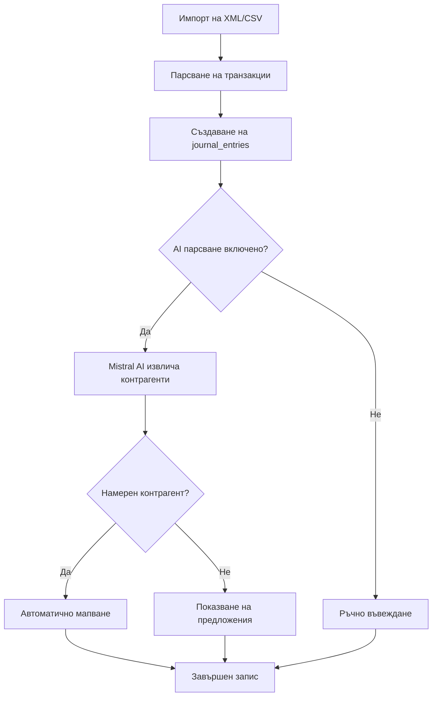

# AI Парсване на Банкови Транзакции 🤖

## Обща информация

Системата автоматично извлича контрагенти от описанията на банкови транзакции използвайки Mistral AI. Това спестява време при обработка на стотици банкови транзакции от импортирани XML/CSV извлечения.

## Функционалност

### 1. Автоматично парсване при импорт

При импорт на банкови извлечения (XML, CSV, MT940), системата:
- ✅ Извлича описанията на транзакциите
- ✅ Парсва ги с Mistral AI за откриване на контрагенти
- ✅ Търси съществуващи контрагенти в базата
- ✅ Автоматично мапва `counterpart_id` ако намери съвпадение

### 2. Ръчно парсване на съществуващи транзакции

За вече импортирани транзакции можете да използвате GraphQL mutations за ръчно парсване.

## Какво се извлича

AI парсерът извлича следната информация от описанията:

| Поле | Описание | Пример |
|------|----------|--------|
| `counterpartName` | Име на контрагент (латиница или кирилица) | `GOLDEN FIRE LTD` |
| `eik` | ЕИК (9 или 13 цифри) | `123456789` |
| `iban` | Банкова сметка | `BG80BNBG96611020345678` |
| `bic` | SWIFT/BIC код | `BNBGBGSD` |
| `city` | Град/населено място | `София`, `MIROVYANE` |
| `transactionType` | Тип транзакция | `Покупка на ПОС`, `Превод` |
| `confidence` | Увереност на AI (0.0-1.0) | `0.85` |

## Пример за работа

### Входно описание:
```
Покупка на ПОС,друга банка в страната,10.40/100,GOLDEN FIRE LTD,MIROVYANE
```

### Извлечена информация:
```json
{
  "counterpartName": "GOLDEN FIRE LTD",
  "eik": null,
  "iban": null,
  "bic": null,
  "city": "Мировяне",
  "transactionType": "Покупка на ПОС",
  "confidence": 0.92
}
```

## GraphQL Mutations

### 1. Парсване на едно описание

```graphql
mutation ParseDescription {
  parseBankTransactionDescription(
    description: "Покупка на ПОС,друга банка в страната,10.40/100,GOLDEN FIRE LTD,MIROVYANE"
  ) {
    counterpartName
    eik
    iban
    bic
    city
    transactionType
    confidence
    foundCounterpartId
  }
}
```

**Отговор:**
```json
{
  "data": {
    "parseBankTransactionDescription": {
      "counterpartName": "GOLDEN FIRE LTD",
      "eik": null,
      "iban": null,
      "bic": null,
      "city": "Мировяне",
      "transactionType": "Покупка на ПОС",
      "confidence": 0.92,
      "foundCounterpartId": 45
    }
  }
}
```

Полето `foundCounterpartId` показва дали е намерен съществуващ контрагент в базата данни.

### 2. Автоматично парсване на цял импорт

```graphql
mutation AutoParseBankImport {
  autoParseBankImport(bankImportId: 123) {
    totalEntries
    parsedCount
    mappedCount
    failedCount
  }
}
```

**Отговор:**
```json
{
  "data": {
    "autoParseBankImport": {
      "totalEntries": 150,
      "parsedCount": 142,
      "mappedCount": 98,
      "failedCount": 8
    }
  }
}
```

**Полета:**
- `totalEntries`: Общ брой журнални записи
- `parsedCount`: Брой успешно парснати описания
- `mappedCount`: Брой автоматично мапнати контрагенти
- `failedCount`: Брой неуспешни парсвания

## Конфигурация

### Mistral AI модел

Системата използва настройката `mistral.api.model` от `contragent_settings`:

```sql
-- По подразбиране: mistral-small-latest
SELECT * FROM contragent_settings WHERE key = 'mistral.api.model';
```

**Препоръчани модели:**

| Модел | Цена | Точност | Препоръка |
|-------|------|---------|-----------|
| `mistral-small-latest` | $0.20/1M tokens | Добра | ⭐ Препоръчителен |
| `mistral-tiny` | $0.15/1M tokens | Основна | За тестване |
| `mistral-large-latest` | $2.00/1M tokens | Отлична | Критични данни |

### API ключ

Mistral API ключът трябва да е конфигуриран в Settings:

1. Отидете на **Settings → Глобални контрагенти и Mistral AI**
2. Въведете Mistral API ключ
3. Запазете настройките

**Или чрез GraphQL:**

```graphql
mutation SetMistralKey {
  upsertContragentSetting(input: {
    key: "mistral.api.key"
    value: "your-api-key-here"
    description: "Mistral AI API ключ"
    encrypted: false
  }) {
    id
    key
  }
}
```

## Поддържани банкови формати

Парсерът работи с всички поддържани банкови формати:

- ✅ **UniCredit MT940** - SWIFT текстови файлове
- ✅ **Wise CAMT.053** - ISO20022 XML
- ✅ **Revolut CAMT.053** - ISO20022 XML
- ✅ **Paysera CAMT.053** - ISO20022 XML
- ✅ **Postbank XML** - Специфичен XML формат
- ✅ **OBB XML** - Обединена българска банка XML
- ✅ **CCB CSV** - Централна кооперативна банка CSV

## Работа с кирилица и латиница

AI парсерът автоматично:
- ✅ Разпознава имена на **кирилица** (`МИРОВЯНЕ`)
- ✅ Разпознава имена на **латиница** (`GOLDEN FIRE LTD`)
- ✅ Транслитерира кирилица → латиница при необходимост
- ✅ Извлича смесени описания (кирилица + латиница)

## Workflow при импорт



## Примери за използване

### Пример 1: Юробанк транзакция

**Описание:**
```
Банково извлечение Юробанк ОЕГ — Транзакция с ДК 516905XXXXXX2355,2803,01.07.2025 14:53:08,
Покупка на ПОС,друга банка в страната,10.40/100,GOLDEN FIRE LTD,MIROVYANE AIRU41453,93912065,
Покупка на ПОС,друга банка POS
```

**Извлечено:**
- Контрагент: `GOLDEN FIRE LTD`
- Град: `MIROVYANE` (Мировяне)
- Тип: `Покупка на ПОС`
- Референция: `AIRU41453`

### Пример 2: Превод с ЕИК

**Описание:**
```
Изходящ превод към АВТОТРАНС ЕООД, ЕИК 123456789, IBAN: BG80BNBG96611020345678
```

**Извлечено:**
- Контрагент: `АВТОТРАНС ЕООД`
- ЕИК: `123456789`
- IBAN: `BG80BNBG96611020345678`
- Тип: `Изходящ превод`

### Пример 3: POS транзакция

**Описание:**
```
LIDL BULGARIA EOOD, Час 13:24, София, Булстат 175468932
```

**Извлечено:**
- Контрагент: `LIDL BULGARIA EOOD`
- ЕИК: `175468932`
- Град: `София`
- Час: `13:24`

## Troubleshooting

### Проблем: AI не извлича данни

**Решение:**
1. Проверете дали Mistral API ключът е валиден
2. Проверете `confidence` - ако е под 0.3, резултатът се игнорира
3. Опитайте с по-мощен модел (`mistral-small-latest` вместо `mistral-tiny`)

### Проблем: Грешно разпознаване на имена

**Решение:**
1. Използвайте `mistral-large-latest` за по-добра точност
2. Проверете описанието - може да е необходимо почистване
3. Създайте контрагента ръчно и AI ще го намери при следващо парсване

### Проблем: Бавно парсване

**Решение:**
1. Парсването е асинхронно и работи паралелно
2. За голям импорт (1000+ транзакции) може да отнеме 2-5 минути
3. Използвайте `autoParseBankImport` mutation за batch обработка

## Разходи

При **150 транзакции** месечно:

| Модел | Цена месечно | Описание |
|-------|--------------|----------|
| `mistral-tiny` | ~$0.01 | Базово ниво |
| `mistral-small-latest` | ~$0.02 | ⭐ Оптимален баланс |
| `mistral-large-latest` | ~$0.20 | Премиум точност |

Средно описание на транзакция: ~50 токена
Изходен отговор: ~100 токена
Общо: 150 tokens × 150 транзакции = 22,500 tokens ≈ $0.02/месец

## Бъдещи подобрения

- [ ] Automatic creation of new counterparts
- [ ] Learning from user corrections
- [ ] Regex fallback for common patterns
- [ ] Multi-language support (English descriptions)
- [ ] Batch processing with progress tracking
- [ ] Integration with Global Contragents validation

## Файлове

**Backend:**
- `/backend/src/services/bank_transaction_parser.rs` - AI парсър
- `/backend/src/services/bank_imports.rs` - Банков импорт
- `/backend/src/graphql/bank_resolvers.rs` - GraphQL mutations

**Frontend:** (предстои)
- Интерфейс за ръчно парсване
- Bulk import с AI мапване
- Преглед на парсирани контрагенти

---

🤖 Генерирано с Claude Code
